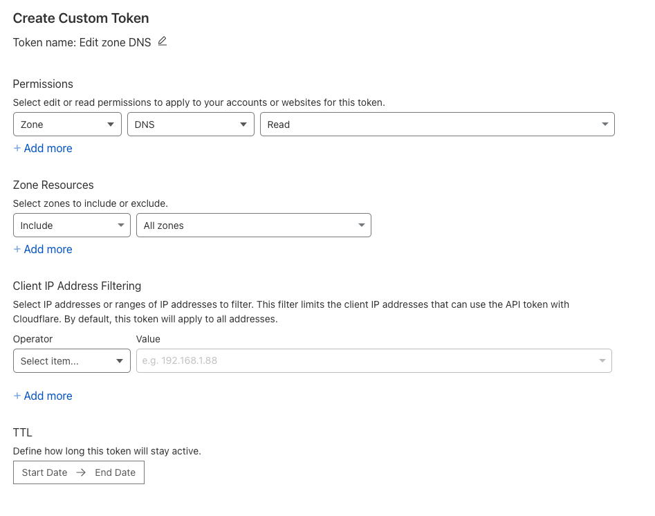

## Cloudflare DNS Backup

The script `cf-dns-backup.sh` will backup all dns records for all domains in the specified Cloudflare accounts. It creates one zone file per domain. Zone files are simple text files and are added to git for simple history tracking.

I recommend running this once a day via cron.

## Install

```
wget "https://raw.githubusercontent.com/Grynn/cf-dns-backup/main/cf-dns-backup.sh" -O /usr/local/bin/cf-dns-backup
chmod +x /usr/local/bin/cf-dns-backup
```

### Configuration

Create `~/.cf-dns-backup/accounts.txt` and add the Cloudflare API tokens (one per line). 

You can get the tokens from https://dash.cloudflare.com/profile/api-tokens
Tokens only need `Zone:DNS:Read` permission. Making read-only tokens is a good idea. Include all zones that you want to backup. 

accounts.txt format:
```
23214134
2131231
```

That's it, no email ids etc. Just API tokens, one per line.
If accounts.txt is found in the same directory as the script, that is used instead.



### Usage

zone files are stored in `zones/` and git is used to track changes. 

After running `cf-dns-backup.sh` for the first time, you could add an origin to the git repo and push to a remote you trust!

```shell
cd zones
git remote add origin <url>
git push -u origin main
```

If a remote is configured, `cf-dns-backup` will try pushing automatically (if changes are detected).

### Cron

Recommended: run via cron once a day 

```
/fullpath/to/cf-dns-backup.sh
```

Use git log, git show etc to examine history. Sync is one way only, so you can't push changes back to Cloudflare.

### Requirements

* gnu parallel
* gnu sed (install `coreutils` via homebrew)
* jq
* flarectl
* git (well, you probably have that already)

Get 'em all with 
```
brew install coreutils parallel jq git flarectl
```
